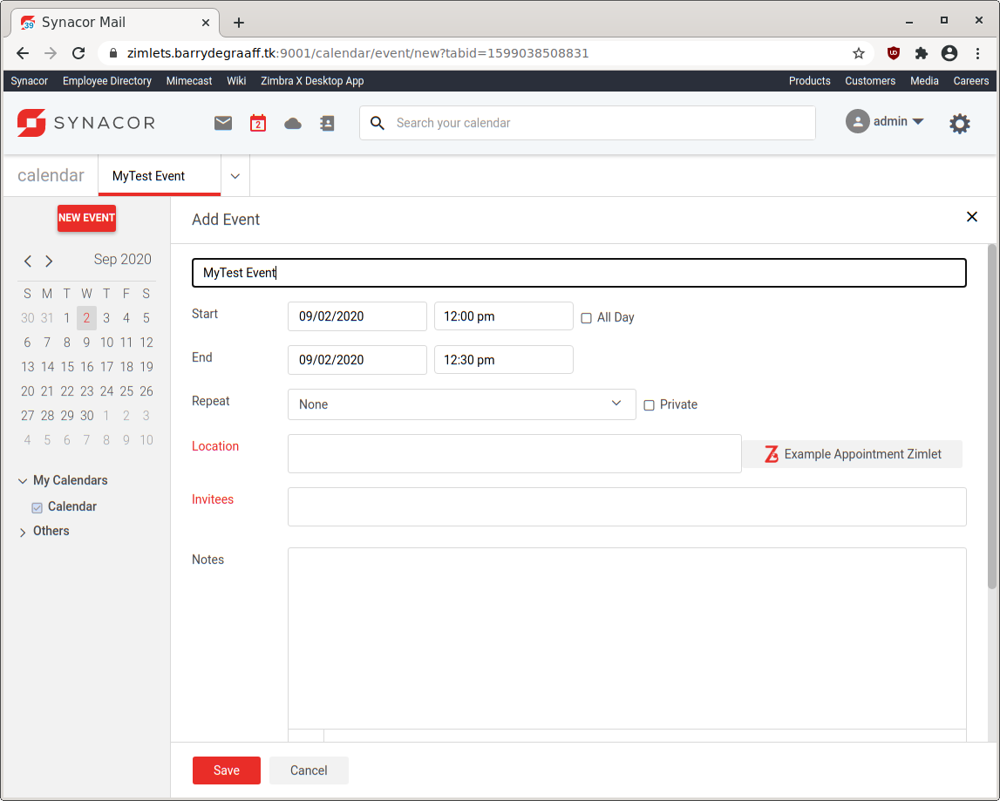
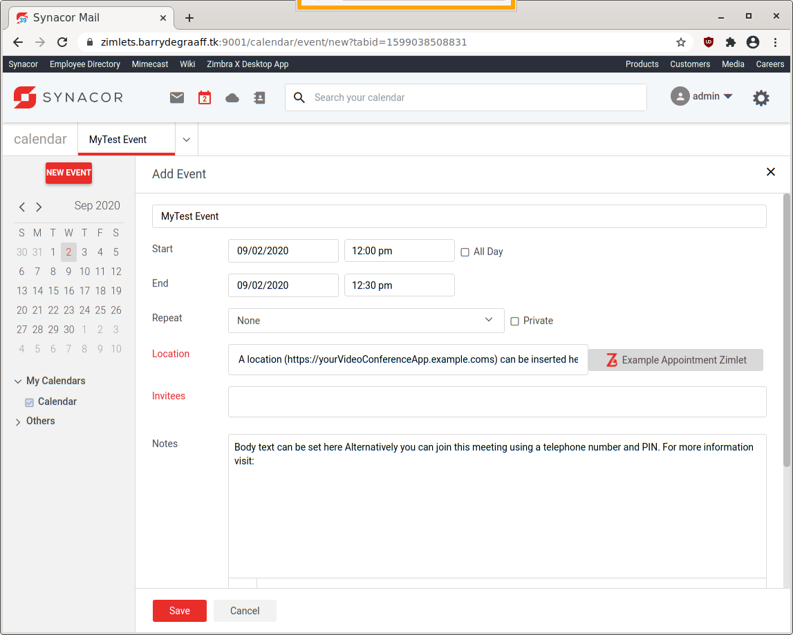

# New appointment Zimlet, video conferencing integration

This article explains how to write a Zimlet that can set the Location and Notes fields on a new appointment. Often this is implemented in Zimlets that integrate 3rd party video conferencing solutions in Zimbra.

## Downloading and running the New appointment Zimlet

Create a folder on your local computer to store the New appointment Zimlet:

      mkdir ~/zimbra_course_pt6
      cd ~/zimbra_course_pt6
      git clone https://github.com/Zimbra/zimbra-zimlet-appointment
      cd zimbra-zimlet-appointment
      npm install
      zimlet watch

The output of this command should be:

```
Compiled successfully!

You can view the application in browser.

Local:            https://localhost:8081/index.js
On Your Network:  https://192.168.1.100:8081/index.js
```

Visit https://localhost:8081/index.js in your browser and accept the self-signed certificate. The index.js is a packed version of the `New appointment Zimlet`. More information about the zimlet command, npm and using SSL certificates can be found in https://github.com/Zimbra/zm-zimlet-guide. 

## Sideload the New appointment Zimlet

Log on to your Zimbra development server and make sure that you are seeing the modern UI. Then click the Jigsaw puzzle icon and Zimlets Sideloader. If you are not seeing the Zimlet Sideloader menu. You have to run `apt/yum install zimbra-zimlet-sideloader` on your Zimbra server and enable the Sideloader Zimlet in your Class of Service.

> 
*Sideload the New appointment Zimlet by clicking Load Zimlet. The Zimlet is now added to the Zimbra UI in real-time. No reload is necessary.*

> 
*In Calendar -> New Event you should now see the Zimlet button `Example Appointment Zimlet`*

> 
*Click the `Example Appointment Zimlet` button to see the Zimlet in action.*

## Visual Studio Code

The `New appointment Zimlet` Zimlet is not a real-world example Zimlet. Instead it has pieces of code that can be used as a cookbook reference. To learn from this Zimlet you should open it in Visual Studio Code and take a look at the methods implemented in the `New appointment Zimlet` button.


Open the folder `~/zimbra_course_pt6/zimbra-zimlet-appointment` in Visual Studio Code to take a look at the code in the New appointment Zimlet. The general structure of the Zimlet and the way menu's are implemented in Zimlet slots has been described in previous guides. Refer to https://wiki.zimbra.com/wiki/DevelopersGuide#Zimlet_Development_Guide.

## Example Appointment Zimlet

The file src/components/more/index.js implements the `New appointment Zimlet` button in the Calendar app under the New Event button. The in-code comments explain how it works:

```javascript
import { createElement, Component, render } from 'preact';
import { compose } from 'recompose';
import { withIntl } from '../../enhancers';
import { useState, useCallback, useMemo, useContext } from 'preact/hooks';
import { Text, IntlProvider, Localizer, IntlContext } from 'preact-i18n';
import style from './style';
import { Button } from '@zimbra-client/blocks';

function createMore(props, context) {
   const childIcon = (
      <span class={style.appIcon}>
      </span>);

   const { intl } = useContext(IntlContext)
   const zimletStrings = intl.dictionary['zimbra-zimlet-appointment-location'];

   const handleClick = (e) => {
      //handleLocationChange is a method passed (via props) to the Zimlet slot that allows you to set the location of the appointment
      props.handleLocationChange({ value: ['A location (https://yourVideoConferenceApp.example.coms) can be inserted here'] });

      //Use dispatch/setEvent to set the notes field of the appointment.
      const { dispatch } = context.store;
      const { setEvent } = context.zimletRedux.actions.calendar;

      //props.notes (is a prop passed via the Zimlet slot) that holds the content of the notes field (at the time the user clicks the Zimlet button)
      //It may have user added content.
      //With setEvent the developer can append/prepend or replace (to) the users notes.

      //props.tabId is a prop that holds the Id of the current UI tab (it is also visible in the address bar of the browser, 
      //https://example.com/calendar/event/new?tabid=1599042149583)

      //to set the notes field:
      dispatch(
         setEvent({
            tabId: props.tabId,
            eventData: {
               notes: 'Body text can be set here ' + zimletStrings.dialInText + ' ' + props.notes,
               isFormDirty: true
            }
         })
      );

   }

   return (
      <Button
         class={style.button}
         onClick={handleClick}
         brand="primary"
         icon={childIcon}
      >
         <Text id={`zimbra-zimlet-appointment-location.title`} />
      </Button>
   );
}

//By using compose from recompose we can apply internationalization to our Zimlet
//https://blog.logrocket.com/using-recompose-to-write-clean-higher-order-components-3019a6daf44c/
export default compose(
   withIntl()
)
   (
      createMore
   )
```
